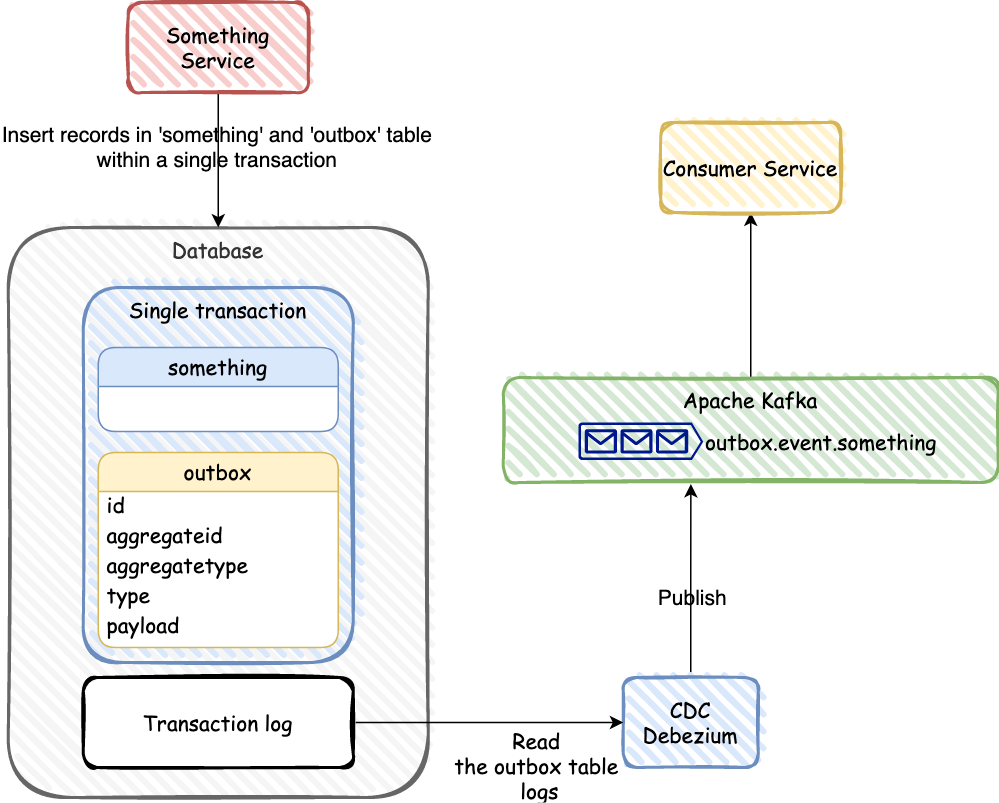
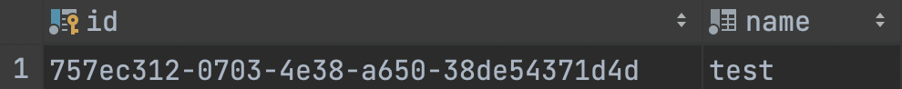
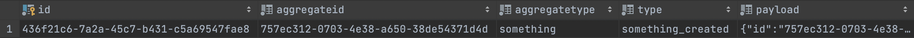

# The Outbox pattern with CDC watch transaction log (Debezium for Kafka)



### 1. Introduction

This post demonstrates how to use Debezium to monitor PostreSQL database. As the data in the database changes, 
you will see the resulting event streams.

>Prerequisites
>
>This tutorial uses Docker and the Debezium container images to run the required services.
You should use the latest version of Docker. For more information, see the Docker Engine installation documentation.

### 2. Why is it needed?

Microservices often do not only have to update their own local data store, 
but they also need to notify other services about data changes that happened. 
The outbox pattern describes an approach for letting services execute these two tasks in a safe 
and consistent manner.

### 3. What is CDC and Debezium?

**CDC** (Change Data Capture) - process of observing data changes to a database and extracting them in
a form in which they can be replicated to derived data systems.

The CDC has some approaches to detect the changes done to the source database:
1) Timestamps on rows
2) Version numbers on rows
3) Status indicators on rows
4) Time/Version/Status on rows
5) Triggers on tables
6) Event programming
7) Transaction log

In this post we'll cover the **Transaction log** approach is fast and does not impose a performance
impact because polling columns of tables is slow and increase load on the source database.

**[Debezium](https://debezium.io/)** - it is an open-source CDC platform built on top of Apache Kafka.
Debezium has connectors to pull a change stream from many databases and send that to Kafka. 
Kafka Connect is used as connectors for change detection and propagation.


### 4. The Outbox Pattern

The idea of this approach is to have an "outbox" table in the service’s database. 

When receiving a request for "something" domain, not only an `INSERT` or `UPDATE` into the 
"something" table is done, but, as part of the same transaction, also a record representing 
the event to be sent is inserted into that outbox table.

"Something" table is assumed to have the following columns:



Outbox table is assumed to have the following columns:



* **id** - Contains the unique ID of the event. In an outbox message, this value is a header. 
You can use this ID, for example, to remove duplicate messages.
* **aggregateid** - Contains the event key, which provides an ID for the payload. 
The Kafka uses this value as the key in the emitted outbox message. 
This is important for maintaining correct order in Kafka partitions.
* **aggregatetype** - This value will be used to route events to corresponding topics in Kafka, so there’d be a topic for all events related to purchase orders, one topic for all customer-related events etc.
* **type** - The type of event, e.g. "Order Created" or "Order Line Canceled". Allows consumers to trigger suitable event handlers.
* **payload** - A representation of the outbox change event. The default structure is JSON. By default, the Kafka message value is solely comprised of the payload value.

For more [information](https://debezium.io/documentation/reference/stable/transformations/outbox-event-router.html).

### 5. Deploy Debezium and related containers

The following docker-compose.yaml file provides the required configuration to start docker containers for a Zookeeper,
an Apache Kafka, a PostgreSQL database, and Debezium instance.
```dockerfile
version: "3"
services:

  zookeeper:
    image: debezium/zookeeper:1.9
    container_name: zookeeper
    ports:
      - "2181:2181"
      - "2888:2888"
      - "3888:3888"

  kafka:
    image: debezium/kafka:1.9
    container_name: kafka
    ports:
      - "9092:9092"
    environment:
      - ZOOKEEPER_CONNECT=zookeeper:2181
      - HOST_NAME=kafka
    depends_on:
      - zookeeper

  postgres:
    image: postgres:14.3
    logging:
      options:
        max-size: "10m"
    container_name: postgres
    environment:
      POSTGRES_USER: root
      POSTGRES_PASSWORD: root
    ports:
      - "5432:5432"
    command:
      - "postgres"
      - "-c"
      - "wal_level=logical"

  debezium:
    image: debezium/connect:1.9
    container_name: debezium
    ports:
      - "8083:8083"
    links:
      - kafka
      - postgres
    environment:
      - BOOTSTRAP_SERVERS=kafka:9092
      - GROUP_ID=debezuim
      - CONFIG_STORAGE_TOPIC=debezium_connect_configs
      - OFFSET_STORAGE_TOPIC=debezium_connect_offsets
      - STATUS_STORAGE_TOPIC=debezium_source_connect_statuses
```

Based on this configuration, you can start all 4 required containers by executing the following command on your command line:
```shell
docker-compose up -d
```

### 6. Create Debezium connector for PostgreSQL

After starting the docker containers, you can configure the Debezium connector.

So, let’s take a look at a simple connector and outbox event router configuration that 
connects as the user root to the "something" database on localhost:5432.

```shell
 curl --location --request POST 'http://localhost:8083/connectors/'
--header 'Content-Type: application/json'
--data-raw '
{
  "name": "something-outbox-connector",
  "config": {
    "connector.class": "io.debezium.connector.postgresql.PostgresConnector",
    "tasks.max": "1",
    "database.hostname": "localhost",
    "database.port": "5432",
    "database.user": "root",
    "database.password": "root",
    "database.dbname": "something",
    "database.server.name": "dbserver1",
    "tombstones.on.delete": "false",
    "table.whitelist" : "public.outbox",
    "key.converter": "org.apache.kafka.connect.storage.StringConverter",
    "value.converter": "org.apache.kafka.connect.storage.StringConverter",
    "transforms": "outbox",
    "transforms.outbox.type": "io.debezium.transforms.outbox.EventRouter"
  }
}'
```

By default, the PostgreSQL connector would monitor all database tables, 
create a topic in Apache Kafka for each of them and publishes an event for each database record that got changed.

That’s obviously not what you want to do if you’re implementing the outbox pattern. 
One of the main ideas of this pattern is that you only expose 1 table as part of your API. 
In this example, that table is called outbox, and it’s part of the public schema. 
By setting the table.whitelist attribute to public.outbox, you can tell the connector to only monitor that table.

### 7. Create event and consume message from Kafka

In this step, we can implement code on Java, invoke REST endpoint value and read event from a consumer of Kafka.

"Something" Controller:
```java
    @PostMapping(SOMETHING)
    @ResponseStatus(HttpStatus.CREATED)
    public SomethingDto createSomething(@RequestBody SomethingCreateUpdateDto createDto) {
        return modelMapper.map(somethingService.create(createDto), SomethingDto.class);
    }
```
"Something" Service:
```java
    @Transactional
    public SomethingEntity create(SomethingCreateUpdateDto createDto) {
        SomethingEntity somethingEntity = SomethingEntity.build(createDto.getName());
        somethingEntityRepository.save(somethingEntity);

        eventPublisher.fire(somethingEvent.createEvent(somethingEntity));
        return somethingEntity;
    }
```

"Something" event:
```java
    public OutboxEvent createEvent(SomethingEntity somethingEntity) {
        String json = objectMapper.convertValue(somethingEntity, JsonNode.class).toString();

        return new OutboxEvent(
                somethingEntity.getId(),
                "something",
                "something_created",
                json
        );
    }
```
EventService:
```java
    @EventListener
    @Transactional
    public void handleOutboxEvent(OutboxEvent event) {
        OutboxEntity outbox = OutboxEntity.buildNew(event);
        outboxEntityRepository.save(outbox);

        /*
         * Delete the event once written, so that the outbox doesn't grow.
         * The CDC eventing polls the database log entry and not the table in the database.
         */
        outboxEntityRepository.delete(outbox);
    }
```

In this method you can pay attention that we delete created value. Because Debezium polls the database log and
not the table in the database.

"Something" Kafka consumer:
```java
    // message consumer must be idempotent
    @KafkaListener(
            topics = "outbox.event.#{'${outbox.listen.something.event}'}",
            groupId = "#{'${spring.kafka.consumer.group-id}'}"
    )
    public void consumeSomethingCreatedEvent(String message) {
        log.info("Consume something created message:{}", message);

        // code...
    }
```

Invoke POST endpoint:
```shell
curl --location --request POST 'http://localhost:8888/gateway/something'
--header 'Content-Type: application/json'
--data-raw '{
  "name": "test"
}'
```

And here we see log from Kafka consumer:
```text
Consume something created message:{"id":"fd1bb3e6-3e31-4b21-a462-3b0c5c100f04","name":"test"}
```

### 8. Conclusion
As you have seen, Debezium provides you a set of connectors and transformers 
that you just need to configure to publish an event whenever you write a new record to the outbox table. 
That makes the implementation of the outbox pattern pretty simple.

Thanks for reading!